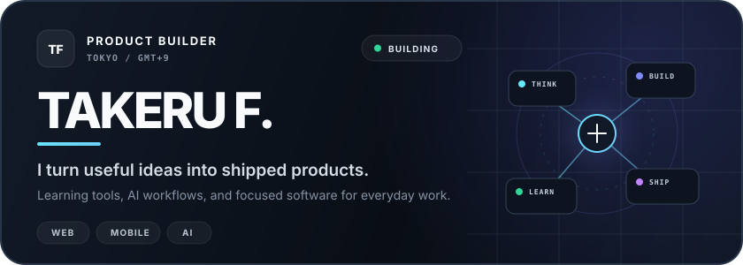

<!--
  ┌─────────────────────────────────────────────────────────────┐
  │  EDIT ME — quick links you may want to update over time      │
  │  • Website (under development): https://example.com          │
  │  • Hanlu app URL:               https://example.com/hanlu    │
  └─────────────────────────────────────────────────────────────┘
  Replace the placeholder URLs above and the matching links below.
-->

 

 

## Hi, I’m Takeru 👋

**Tokyo / Waseda University · Creator of [Hanlu](https://hanlu.app/about)** <!-- EDIT: Hanlu URL -->

I’m a product-building student developer focused on shipping real things — building products that make **learning** and **AI workflows** more useful. I work across web, mobile, and AI.

🌐 Website — *under development* → [takeru.dev](https://me-teal-alpha.vercel.app) <!-- EDIT: Website URL -->

 

## 🛠️ Tech Stack

  
  
  
  
  
  
  
  
  
  

 

## 🚀 Featured Projects

| Project | What it is |
| :-- | :-- |
| **📊 [TOKEN METER](https://takeruf.github.io/token_meter/)** | A native macOS app for monitoring Claude Code and Codex usage from the menu bar and desktop widgets. |
| **🀄 Hanlu** | A Chinese learning app — focused, modern, and built to make language practice actually stick. |
| **🧠 AI Studio** | A human-in-the-loop AI workflow & review board for steering and approving AI output with confidence. |
| **📇 Client Info Management** | A CRM-style system for organizing client information and relationships. |
| **🌌 Portfolio / Me** | An interactive, universe-themed personal site. *(under development)* |

 

## 📊 GitHub Stats

<!--
  Stats + languages are rendered from a self-hosted SVG generated in-repo by
  .github/workflows/metrics.yml (lowlighter/metrics). This avoids the flaky
  public github-readme-stats.vercel.app instance, which frequently 503s.
-->

 

 

### 🐍 Contribution Snake

<picture>
  <source media="(prefers-color-scheme: dark)" srcset="https://raw.githubusercontent.com/TakeruF/TakeruF/output/snake-dark.svg" />
  <source media="(prefers-color-scheme: light)" srcset="https://raw.githubusercontent.com/TakeruF/TakeruF/output/snake.svg" />
  
</picture>

<!--
  The snake images above are generated automatically by .github/workflows/snake.yml
  and pushed to the `output` branch. They will 404 until that workflow has run once.
  Run it manually from the Actions tab the first time (Run workflow).
-->

 

  ✨ Building the Takeru Universe, one product at a time.

